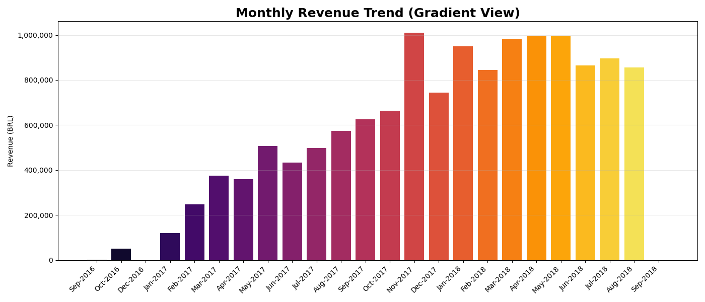
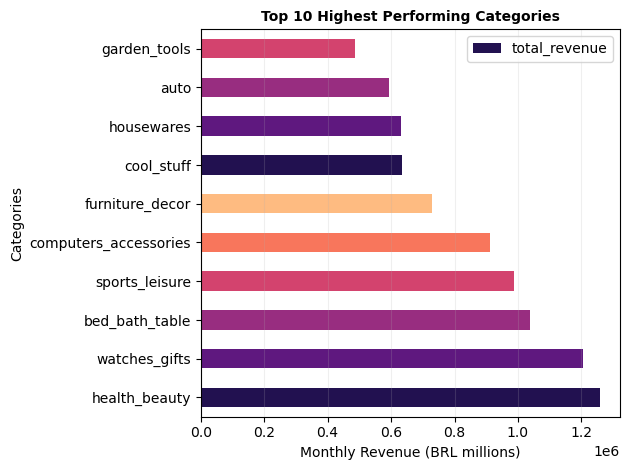
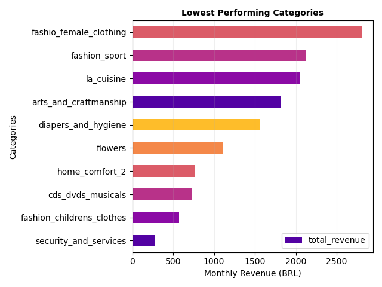
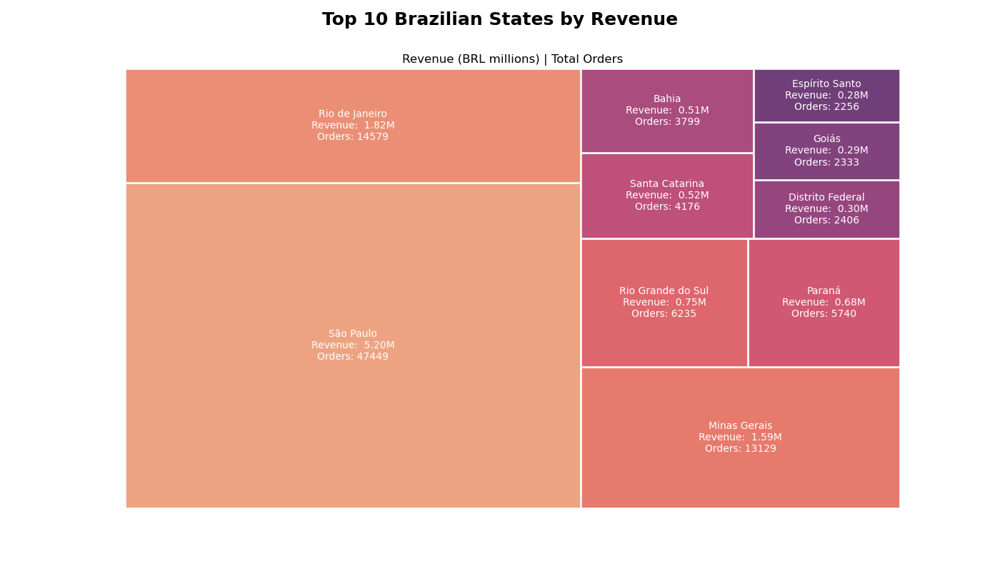

# Olist E-Commerce SQL Analysis
### by Zubeen Khalid

This project analyses 100,000 real orders from Olist, a Brazilian e-commerce marketplace, placed between 2016 and 2018. Ten business questions are answered across four areas: revenue, delivery, sellers and customer behaviour.

---

## Key Findings

| Area | Question | Finding |
|---|---|---|
| Revenue | Which product categories generate the most revenue? | Health and Beauty is the top category with BRL 1.26M in revenue and a strong average review score of 4.14 |
|  | Is monthly revenue growing? | Revenue grew from BRL 120,000 in January 2017 to BRL 1,000,000 by early 2018 |
|  | Which month performed best? | November 2017 produced BRL 1,010,271, consistent with Black Friday demand |
| Delivery | What percentage of orders arrive on time? | 89.15% of orders are delivered on time, though 2,965 missing delivery records mean the true rate may be lower |
|  | How accurate are delivery estimates? | Orders arrive on average 11.87 days earlier than the estimated date, suggesting estimates are consistently conservative |
|Sellers | Where are top sellers based? | 9 out of 10 top revenue-generating sellers are based in São Paulo, revealing significant geographic concentration risk |
|  | Which sellers are underperforming? | 6 sellers score below 3.0 in average review score; three of them have over 100 orders each |
| | What is causing poor reviews? | For 4 of the 6 underperforming sellers, on-time delivery rates between 64% and 75% identify logistics as the primary issue, not product quality |
| Customer Behaviour | What does the average customer spend? | The average transaction value is BRL 161, ranging from BRL 1,098 for computers to BRL 25 for home comfort items |
|  | Which states generate the most revenue? | São Paulo generates BRL 5.2M in revenue, roughly three times more than Rio de Janeiro, the second largest state |

**Revenue grew consistently throughout 2017, peaking sharply in November with Black Friday demand.**

---

## Business Recommendations

**Revenue and Marketing**
- Health and Beauty, Watches and Gifts and Cool Stuff should be prioritised for marketing investment. These three categories combine high revenue, strong review scores and clear growth potential
- Watches and Gifts campaigns should target Christmas, Valentine's Day and Mother's Day when gifting demand peaks
- Capitalise on the Black Friday opportunity identified in November 2017 by ensuring sellers are stocked and logistics are prepared ahead of time each year
- Low-performing categories including CDs/DVDs, Flowers and Diapers should be reviewed or discontinued where revenue is low and structural decline is likely to continue

**Health and Beauty, Watches and Gifts and Cool Stuff lead on both revenue and customer satisfaction.**

**CDs, Flowers and Diapers generate minimal revenue and show no signs of growth.**

**Delivery**
- Recording delivery dates should be made mandatory for all sellers. 2,965 missing delivery records currently make it impossible to accurately measure performance
- Delivery estimates should be updated to reflect the actual 11.87 day early delivery average, as more accurate estimates would improve customer trust

**Sellers**
- The 6 sellers scoring below 3.0 should be investigated immediately. Three of them have over 100 orders each, meaning the customer impact is already significant
- A minimum review score threshold and a structured improvement plan should be introduced before any removal decision is made

**Geographic Growth**
- Olist should reduce its overdependence on São Paulo by running targeted campaigns in Minas Gerais, Rio Grande do Sul and Paraná
- Logistics partnerships in northern states should be explored to reduce delivery barriers and make the platform more accessible

**São Paulo dominates the platform, generating nearly three times more revenue than any other state.**

---

## Dataset

Real commercial data published by Olist on Kaggle, anonymised for public use. The dataset consists of 11 relational tables covering orders, customers, sellers, products, payments and reviews.

[Brazilian E-Commerce Public Dataset by Olist](https://www.kaggle.com/datasets/olistbr/brazilian-ecommerce)

---

## Tools Used

Python · DuckDB · pandas · matplotlib · seaborn

---

## How to Run

1. Download the dataset from the Kaggle link above
2. Place all CSV files inside a folder called `data` in the project directory
3. Open `olist_data_exploration.ipynb` and run all cells
